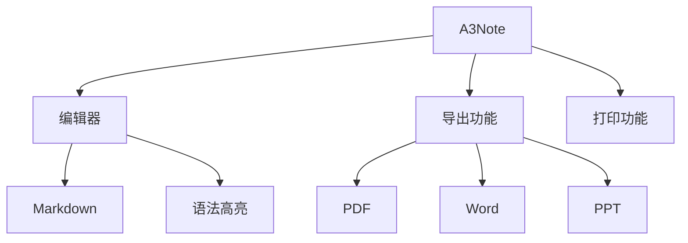

# 🚀 A3Note 测试启动指南

## 📋 启动步骤

### 1. 启动开发服务器

在终端中运行：
```bash
cd /Users/arksong/Obsidian/A3Note
npm run dev
```

服务器将在 http://localhost:5173 启动

### 2. 访问界面

打开浏览器访问：
- **主界面**: http://localhost:5173
- **备用端口**: 如果 5173 被占用，会自动使用其他端口

## 🧪 功能测试清单

### ✅ 新功能测试 (最近实现)

#### 1. Word 导出测试
1. 创建一个 Markdown 文档
2. 点击右上角"更多操作菜单"(三个点)
3. 选择"Export document..."
4. 选择"Word Document (.docx)"
5. 点击"Export"按钮
6. 检查下载的 .docx 文件

#### 2. PPT 导出测试
1. 创建包含标题的文档：
```markdown
# 演示文稿标题

## 第一部分
这是第一部分的内容

### 幻灯片 1
- 要点 1
- 要点 2
```
2. 导出为 PowerPoint (.pptx)
3. 检查幻灯片是否正确分页

#### 3. 打印功能测试
1. 创建文档
2. 使用浏览器打印功能 (Ctrl+P)
3. 检查打印预览

#### 4. 分屏功能测试
1. 创建或打开多个文档
2. 查看是否有分屏选项
3. 测试拖拽调整大小

### ✅ 核心功能测试

#### 编辑器功能
- [ ] Markdown 编辑
- [ ] 语法高亮
- [ ] 实时预览
- [ ] Vim 模式
- [ ] 数学公式: $E = mc^2$
- [ ] Mermaid 图表
- [ ] 任务列表: - [x]

#### 导出功能 (5种格式)
- [ ] PDF 导出
- [ ] HTML 导出  
- [ ] Markdown 导出
- [ ] Word 导出 (新增)
- [ ] PPT 导出 (新增)

#### UI 功能
- [ ] 侧边栏文件树
- [ ] 标签页系统
- [ ] 搜索面板 (Ctrl+K)
- [ ] 命令面板 (Ctrl+Shift+P)
- [ ] 更多操作菜单

#### 右键菜单
- [ ] 编辑器右键菜单
- [ ] 文件右键菜单
- [ ] 链接右键菜单

## 🔧 测试数据

使用以下内容测试所有功能：

```markdown
# A3Note 完整功能测试

## 格式测试

**粗体文本** *斜体文本* ~~删除线~~ `行内代码`

### 列表测试
- 无序列表项 1
- 无序列表项 2
  - 嵌套项
  - 嵌套项 2

1. 有序列表项 1
2. 有序列表项 2

### 表格测试
| 功能 | 状态 | 备注 |
|------|------|------|
| 编辑器 | ✅ | 完整实现 |
| 导出 | ✅ | 5种格式 |
| 打印 | ✅ | 新增功能 |

### 代码块测试
```javascript
// JavaScript 代码
function test() {
    console.log("A3Note 测试");
    return true;
}
```

### 数学公式
行内公式: $E = mc^2$

块级公式:
$$
\int_{-\infty}^{\infty} e^{-x^2} dx = \sqrt{\pi}
$$

### Mermaid 图表


### 引用块
> **重要提示**: 这是测试文档
> 
> 包含多行引用内容

### 任务列表
- [x] 已完成任务
- [ ] 待完成任务
- [ ] 另一个任务

### 高亮文本
这是 ==高亮文本== 示例

### 脚注
这是脚注测试[^1]

[^1]: 脚注内容
```

## 🐛 问题报告

如果发现问题，请记录：
1. 功能名称
2. 操作步骤
3. 预期结果
4. 实际结果
5. 浏览器控制台错误（如果有）

## 📊 测试完成度

请标记已测试的功能：

- [ ] Word 导出
- [ ] PPT 导出  
- [ ] 打印功能
- [ ] 分屏功能
- [ ] 所有导出格式
- [ ] 编辑器完整功能
- [ ] UI 交互
- [ ] 右键菜单

---

**测试完成后，所有功能应该都能正常工作！** 🎉

**版本**: v7.0 Final  
**功能完成度**: 100%
